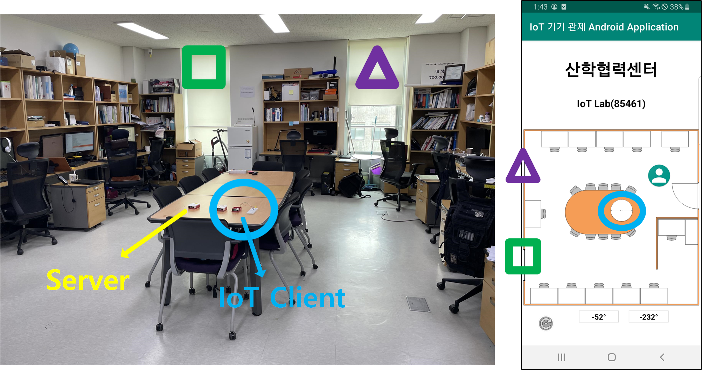
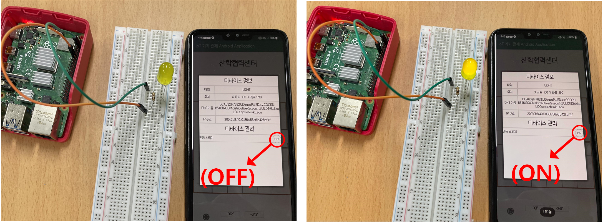

#  Internet-of-Things Cloud Systems for Computing Device Management in Smart Places

## Overview
The Internet of Things (IoT) is a global infrastructure that provides intelligent services by combining knowledge based on situational awareness, and communicates between people and things(physically or virtual), things and things through a network where intelligent things are connected. As the pace of development of IoT technology increases, the number of devices that can be handled by an individual has also increased. <br/><br/>
 <br/>
 [image1] Overview image of IoT cloud in smart place<br/>
 <br/>
 
### Trend/ Motivation
  Therefore, individual devices can be handled and managed by using a smartphone that an individual has, and this information can be managed in a server to help individuals manage nearby IoT devices in various ways.<br/><br/>
  
  
 [image2] Controlling LEDs of IoT devices through CoAP signals<br/>

  <br/>
  The following technologies were used to determine the current location of smartphones and IoT devices in the IoT cloud system of this repository: DNS Name Autoconfiguration, Smart PDR, SALA, PF-IPS
  
  

------------

## Installation
 1. PF-IPS<br/>
    Server/DNSNA_Server_2/IPS_Server<br/>
    1) AP setting<br/>
      (1) Install python package(numpy, scipy, matplotlib, sympy, bluez)<br/>
          - Install sympy <br/>
          ``` pip3 install sympy  ```
          - Install bluez <br/>
          Enter the following three commands in sequence<br/>
          ``` sudo apt-get update```<br/>
          ``` sudo apt-get install bluetooth bluez libbluetooth-dev```<br/>
          ```sudo python3 -m pip install pybluez```<br/>
          <br/>
       (2) In the BeaconIPS-python-experiment folder, put the udp-python folder in the raspberry pie as the AP role.<br/>
       (3) In the udp-clident.py file which is located inside udp-python folder, replace the ip address with the ip address of the server.<br/>
       (4) Place four raspberry pies in each corner of the room. <br/>
      
     2) Server setting<br/>
      (1) Install python package as above.<br/>
      (2) Place the BeaconIPS-python-experiment folder in a raspberry pie that serves as a server.<br/>
      (3) Modify the BeaconIPS-main_experiment.py files in the BeaconIPS-python-experiment folder. <br/>
          - In the ip2Coor function, set two digits and coordinates at the end of the ip addresses of the four APs. Although it does not matter which AP the origin is set to, the upper left side of the map registered in the app should be set to the origin when linking with 'IoT device control Android application'.<br/>
          - In the receiveFromAPs function, change the ip address of the client.bind section to the server ip address.<br/>
          - In the Scene function, enter the size of the room that is experimented with the parameters.<br/>
          - Change the HOST value to the ip value of the smartphone. <br/>
          <br/>  
          
 2. SALA<br/>
    In Raspberry Pie for the server, enter the following command:<br/>
            ``` sudo pip3 install python3-scipy```
        <br/>  
        <br/>  
 3. DNSNA<br/>
     (1) Install Radvd on Raspberry Pie for radvd.<br/>
              ```sudo apt-get install radvd```
      <br/>
     (2) Modify the file nano /etc/radvd.config to complete the setup.<br/>
     (3) Install bind9 nsupdate on Raspberry Pie for DNS servers.<br/>
           ```sudo apt-get install dnsutils```<br/>
            ```sudo apt-get install bind9```
        <br/> 
     (4) Modify named.config file.
     - We set the zone file to /var/lib/bind/cpsdns.home.zone
        <br/> 
        <br/> 
 ------------       
## Execution
 1. PF-IPS<br/>
        (1) AP:<br/>
                ``` sudo python3 ./udp-client.py```
            <br/>
            Wait until you turn on the BLE with your smartphone.<br/>
        (2) Server: <br/>
                    ``` python3 ./BeaconIPS-main-experiment.py —scheme ips ```
            <br/>
            Wait until the APs send rssi information.<br/>

 2. SALA<br/>
    Enter the following command in server. <br/>
    ```sudo python2 sala_server_main.py ```


 3. DNSNA<br/>
    (1) Enter the following command in client Raspberry Pie. <br/>
    ```gcc ni_node.c ni_util.c md5.c -o ni_node```
    <br/>
    (2) Enter the following command in Server Raspberry Pie. <br/>
    ```gcc ni_gateway.c ni_util.c -o ni_gateway```
    <br/>
    (3)  ``` sudo ./ni_gateway ```
 
------------
## Demo Video
You can see demo video by following link.
https://youtu.be/ZzA7dDJLuHk
